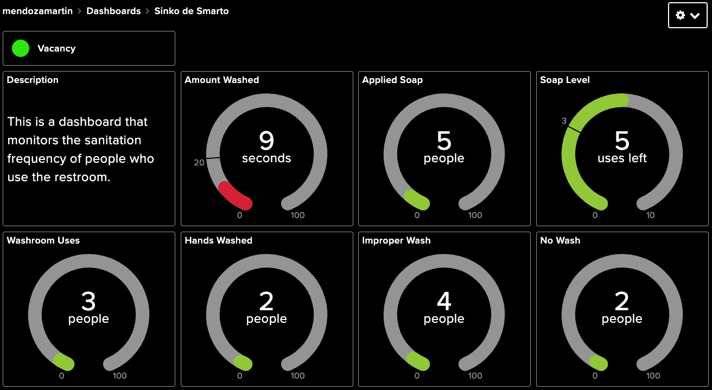

# Sinko-de-Smarto

## Background

There is a dire need to maintain proper sanitation practices, especially during this worldwide pandemic. An area that people tend to take sanitation shortcuts is after using the washroom. They either wash their hands properly, wash their hands quickly or do not wash at all. This project aims to create a smart sink that collects handwashing data in a non-invasive way. This smart sink will collect data on the length of time users wash their hands for, if they apply soap while washing and provide alerts if the soap dispenser is low. This data will be compared to the amount of people that used the washroom and proper hand washing practices so that companies are able to know if their employees are practicing proper sanitation. If they are not, the company will be able to enforce better sanitation protocols.

